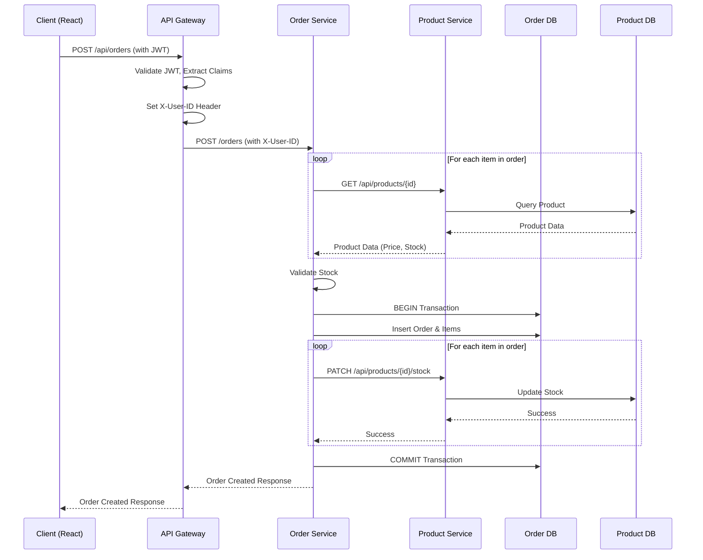

# System Architecture & Request Lifecycle

This document describes the overall architecture and request lifecycle of the `sales-system`.

## System Architecture

The application is built using a microservices architecture with a Go backend and a React frontend. The services are containerized and orchestrated using Docker Compose.

### Components:

*   **Frontend**: A React single-page application (SPA) running on port `3000`.
*   **API Gateway**: A Go-based gateway running on port `8080`. It acts as the single entry point for all client requests, routing them to the appropriate backend service. It also handles authentication and CORS.
*   **Auth Service**: A Go microservice running on port `8001` that handles user registration, login, and token validation. It uses its own PostgreSQL database (`auth_db`).
*   **Product Service**: A Go microservice running on port `8002` that manages product catalog and inventory. It uses its own PostgreSQL database (`product_db`).
*   **Order Service**: A Go microservice running on port `8003` that handles order creation, retrieval, and status updates. It interacts with the Product Service to verify and update stock. It uses its own PostgreSQL database (`order_db`).
*   **PostgreSQL**: A shared PostgreSQL instance running on port `5432`, but each service logically uses a separate database.

### Internal Communication

Services communicate with each other over the internal Docker network (`sales-network`). For example, the Order Service makes HTTP calls to the Product Service (`http://product-service:8002`) to verify stock and deduct inventory when an order is placed.

## Request Lifecycle

The API Gateway is central to the request lifecycle. Here's how different types of requests are handled:

### 1. Unauthenticated Requests (e.g., Login/Register, Public Products)

1.  **Client Request**: The frontend makes an HTTP request to the API Gateway.
2.  **API Gateway Routing**:
    *   If the request is for `/api/auth/register` or `/api/auth/login`, the gateway proxies it directly to the Auth Service.
    *   The `/api/products` and `/api/categories` routes are also configured as public routes and will be proxied directly to the Product Service without requiring an authentication token.
3.  **Service Processing**: The target service processes the request (e.g., validates credentials, creates a token) and returns a response to the gateway.
4.  **Gateway Response**: The gateway forwards the response back to the client.

### 2. Authenticated Requests (e.g., Create Order)

1.  **Client Request**: The frontend makes an HTTP request to an endpoint (e.g., `POST /api/orders`) and includes a JWT in the `Authorization` header (`Bearer <token>`).
2.  **API Gateway Authentication**:
    *   The request hits the API Gateway.
    *   The `authMiddleware` intercepts the request.
    *   It extracts the JWT, verifies its signature using the `JWT_SECRET`.
    *   If valid, it extracts the claims (e.g., `user_id`, `role`, `email`).
    *   It injects these claims into the request context and sets custom HTTP headers (`X-User-ID`, `X-User-Role`, `X-User-Email`).
3.  **API Gateway Routing**: The gateway proxy forwards the request, along with the injected headers, to the appropriate downstream service (e.g., Order Service). Notice that the `/api` prefix is stripped before sending to the internal service.
4.  **Service Processing**:
    *   The Order Service receives the request.
    *   It reads the `X-User-ID` header to know which user is making the request.
    *   For a `POST /orders` request, the Order Service will make synchronous HTTP calls to the Product Service to verify stock availability for each item.
    *   If stock is available, it starts a database transaction.
    *   It saves the order to its database.
    *   It makes synchronous HTTP `PATCH` calls to the Product Service to deduct the stock.
    *   It commits the transaction.
5.  **Service Response**: The Order Service returns the created order data to the gateway.
6.  **Gateway Response**: The gateway forwards the response back to the client.

## Data Flow Diagram (Example: Create Order)

